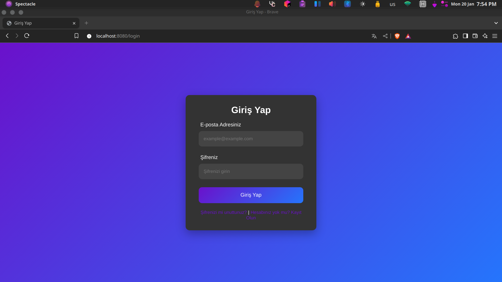
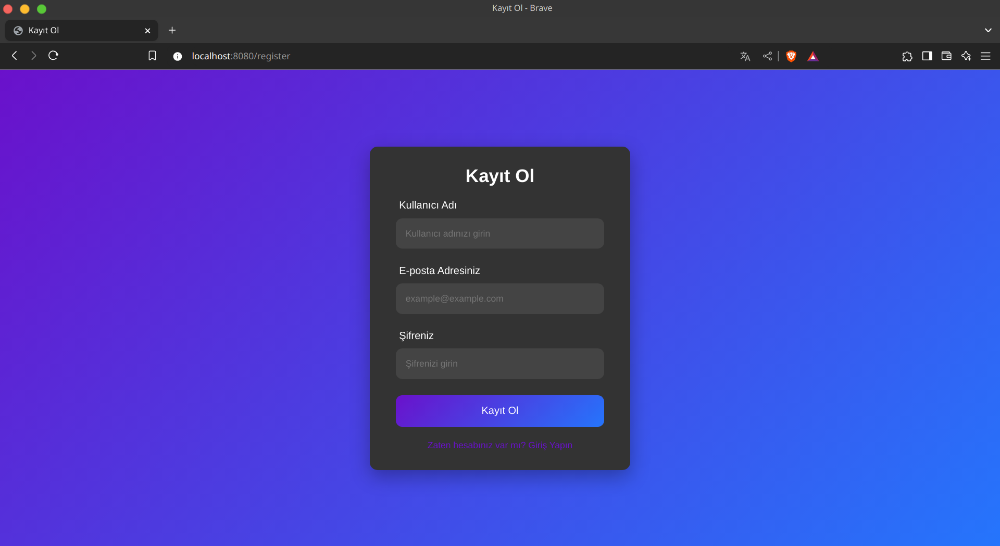
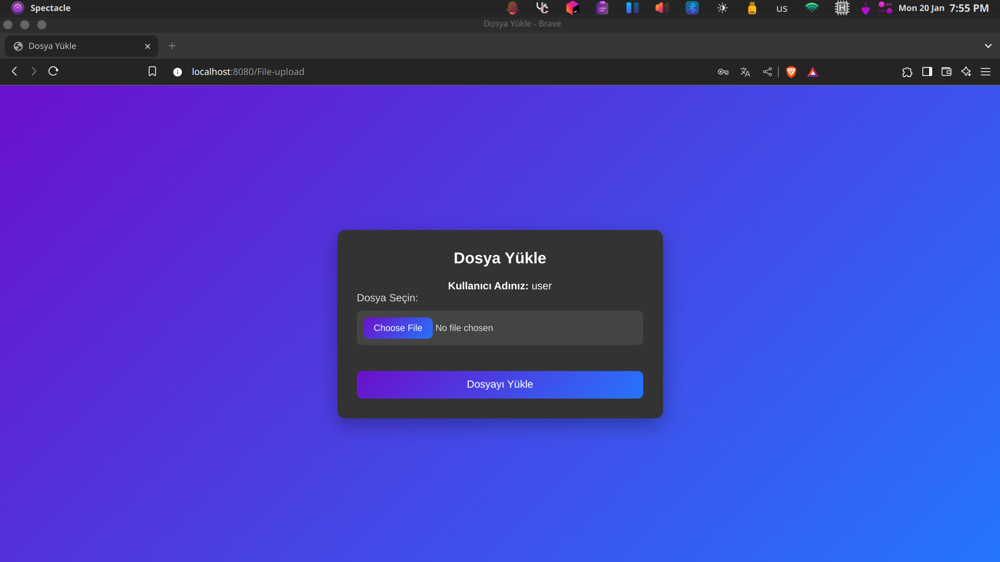

# FIleupload

## Açıklama

FIleupload, **Spring Boot** kullanılarak geliştirilmiş bir dosya yükleme sunucusudur. Bu proje, backend kısmında Spring
Boot teknolojilerini kullanmakta ve frontend kısmı ise hazır bir kaynaktan temin edilmiştir (*örneğin*: bir açık kaynak
frontend şablonu).

## Özellikler

- **Spring Data JPA** ile veri tabanı işlemleri.
- **Spring Security** ile güvenlik altyapısı.
- **Thymeleaf** ile şık ve dinamik bir arayüz.
- **Docker Compose** ile kolay konteyner entegrasyonu.
- Dosya yükleme ve backend işlevselliği tamamen hazır.
- **Hazır Frontend Kullanımı** (HTML/CSS/JS gibi bileşenler tamamen alınan frontend temasıyla entegredir).

## Gereklilikler

- **Java 17** veya daha üstü
- **Maven**
- **MySQL**
- **Docker Compose** (isteğe bağlı)

---

## Kurulum

1. **Projeyi Klonlayın**:
   ```bash
   git clone https://github.com/range79/FIle-upload.git
   cd FIleupload
   ```

2. **Bağımlılıkları Yükleyin**:
   ```bash
   mvn clean install
   ```

3. **Veritabanını Ayarlayın**:  
   MySQL üzerinde bir veritabanı oluşturun ve `src/main/resources/application.yaml` dosyasını düzenleyin:
   ```yaml
   spring:
     datasource:
       url: jdbc:mysql://<host>:<port>/<veritabani_adi>
       username: <kullanici_adi>
       password: <sifre>
     jpa:
       hibernate:
         ddl-auto: update # İlk kullanımda veritabanını otomatik oluşturabilir
       show-sql: true # Konsolda sorguların görünmesi için
   ```

4. **Uygulamayı Çalıştırın**:
   ```bash
   mvn spring-boot:run
   ```

---

## Kullanılan Teknolojiler

- **Spring Boot** 3.4.1
- **Spring Security**
- **Thymeleaf**
- **MySQL**
- **Docker Compose**
- **Lombok**
- **Kotlin Desteği**

---

## Frontend

Projenin frontend kısmı hazır bir şablondan alınmıştır ve geliştirme yapılmadan backend ile entegre edilmiştir. Frontend
şablonu HTML, CSS ve JavaScript teknolojilerini kullanmaktadır. Statik dosyalar `src/main/resources/static` klasörü
altında tutulmaktadır.

**Ekran Görüntüleri**:

**Login Sayfası:**



**Register Sayfası:**



**Dosya Yükleme Sayfası:**



---

## Testler

Projede birim ve entegrasyon testleri için aşağıdaki komut çalıştırılabilir:

```bash
mvn test
```

---

## Katkıda Bulunma

Projenize katkıda bulunmak isteyenler için adımlar:

1. Bu projeyi fork edin.
2. Yeni bir branch oluşturun:
   ```bash
   git checkout -b ozellik/yeni-ozellik
   ```
3. Değişikliklerinizi commit edin:
   ```bash
   git commit -m "Yeni özellik eklendi."
   ```
4. Değişikliklerinizi push edin:
   ```bash
   git push origin ozellik/yeni-ozellik
   ```
5. Bir pull request (PR) gönderin.

---

## Lisans

Bu proje **MIT Lisansı** ile lisanslanmıştır. Detayları aşağıda bulabilirsiniz:

```plaintext
MIT Lisansı

Copyright (c) 2023 range79

İzin, bu yazılımın bir kopyasını edinen herhangi bir kişiye, yazılımı kısıtlama olmaksızın kullanma, kopyalama, değiştirme, birleştirme, yayınlama, dağıtma, alt lisans verme ve/veya yazılımın kopyalarını satma hakkı bedelsiz olarak verilir. Ancak, yukarıdaki telif hakkı bildirimi ve bu izin bildirimi, yazılımın tüm kopyalarına veya önemli bölümlerine dahil edilmelidir.

YAZILIM "OLDUĞU GİBİ" SAĞLANIR, TİCARİLİK, BELİRLİ BİR AMACA UYGUNLUK VEYA HAK İHLALİ OLMADIĞINA DAİR HERHANGİ BİR GARANTİ OLMAKSIZIN, AÇIK YA DA ZIMNİ HİÇBİR GARANTİ VERİLMEZ. YAZILIMDAN YA DA KULLANIMINDAN KAYNAKLANAN HİÇBİR ZARARDAN, YAZARLAR VEYA TELİF HAKKI SAHİPLERİ SORUMLU DEĞİLDİR.
```

---
